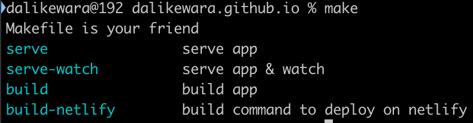
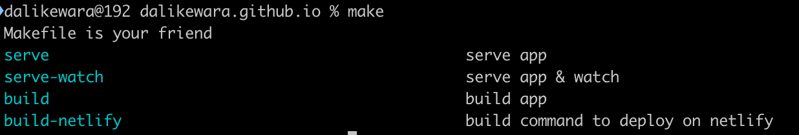

Kamu sering lupa apa saja nama-nama *command* yang sudah dibuat di **Makefile**?
dan capek harus *nge-check-in file* **Makefile** nya terus? cobalah *script* praktis
dibawah ini:

```shell
info:
	@echo "Makefile is your friend"
	@awk 'BEGIN {FS = ":.*?## "} /^[a-zA-Z_-]+:.*?## / {printf "\033[36m%-20s\033[0m %s\n", $$1, $$2}' $(MAKEFILE_LIST)
```

*Script* diatas `awk 'BEGIN {FS = ":.*?## "} /^[a-zA-Z_-]+:.*?## / {printf "\033[36m%-20s\033[0m %s\n", $$1, $$2}' $(MAKEFILE_LIST)`, akan menampilkan semua *list command* yang ada&mdash;beserta dengan
deskripsinya&mdash;apabila tersedia.
Contoh:

```shell
info:
	@echo "Makefile is your friend"
	@awk 'BEGIN {FS = ":.*?## "} /^[a-zA-Z_-]+:.*?## / {printf "\033[36m%-20s\033[0m %s\n", $$1, $$2}' $(MAKEFILE_LIST)

serve: ## serve app
	@JEKYLL_ENV=production jekyll serve

serve-watch: ## serve app & watch
	@JEKYLL_ENV=production jekyll serve --watch --livereload

build: ## build app
	@JEKYLL_ENV=production jekyll build

build-netlify: build ## build command to deploy on netlify
```

*Output*:



Kalau nama *command* nya terlalu panjang, kamu bisa mengatur ulang jarak dengan deskripsinya
dengan mengubah bagian ini ...36m%-**20s**\033..., misal:

```shell
info:
	@echo "Makefile is your friend"
	@awk 'BEGIN {FS = ":.*?## "} /^[a-zA-Z_-]+:.*?## / {printf "\033[36m%-50s\033[0m %s\n", $$1, $$2}' $(MAKEFILE_LIST)
```

*Output*:

