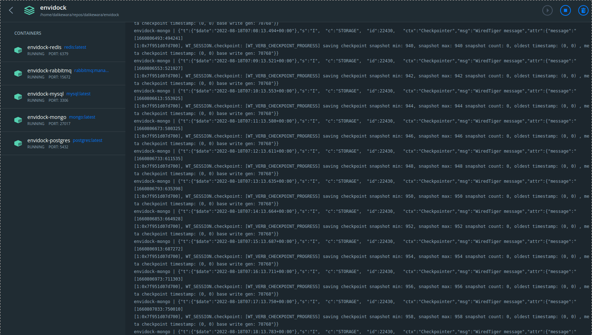

Untuk menunjang pekerjaan saya, di *local environment* saya butuh beberapa *service* infra berjalan, seperti
*database* hingga *message broker*. Karena saya pakai **docker**, tentunya memasang *service-service* tadi
itu mudah. Tapi saya buat agar lebih mudah dengan **envidock**. Hanya cukup sekali *run command*, bisa
menjalankan semua *service* sekaligus.

```shell
make build
```



Di **envidock** sudah ada beberapa *database* yang dimasukkan kedalam `docker-compose.yml`, seperti
**MySQL (latest)**, **Mongo (latest)**, **Redis (latest)** hingga **RabbitMQ** dengan *management plugin enabled*.
Kalau kamu pengen pakai **envidock**, silahkan bisa di check di *repo* nya -> [https://github.com/dalikewara/envidock](https://github.com/dalikewara/envidock)