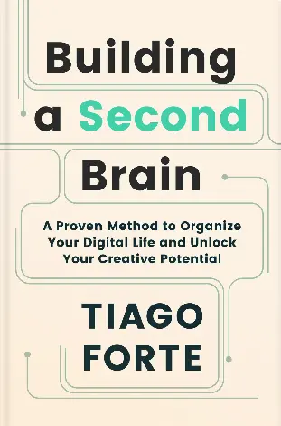

# Building a Second Brain

{ align=left img-size=md img-pos=left }

I recently came across an interesting concept called a Second Brain, thanks to [Hilman's Twitter thread](https://twitter.com/hilmanski/status/1581596970472288256)
and the book [Building a Second Brain](https://www.buildingasecondbrain.com/). Basically, it’s a system to store and organize
information so you can actually use it later.

Why do we need it? Our brains are great for thinking, but not always for remembering tons of info. Without a system, ideas can
feel scattered and hard to act on. A Second Brain helps capture, organize, and retrieve info so it’s useful in daily life, work
projects, or personal growth.

---

<!-- more -->

## Daily Life Example

After meetings or feature grooming sessions, I often take quick notes—key points, specs, testing steps, or PRD highlights. Later, when
tasks pile up, I can check my notes instead of relying on memory alone. That’s basically me building my own Second Brain. Even small notes help a lot.

## FOMO & Info Overload

Ever feel like you’re missing out? Happens to me in stocks or crypto—people share predictions, and it’s tempting to jump in. With a Second Brain,
you can process info properly instead of reacting impulsively. It’s not just about storing info, but making sense of it.

## Tools for Your Second Brain

Digital tools like Evernote, Google Keep, or Apple Notes are great because you can:

- Search easily  
- Group and organize info  
- Sync across devices  
- Share if needed  

Analog tools (notebooks, kanban boards) can work too, as long as notes are easy to manage.

## How It’s Different from Regular Notes

A diary or normal notes just capture events. A Second Brain is systematic, with follow-ups. It’s meant to help you act on
or recall info later, not just for now.

## CODE Method

The book suggests **CODE**: **Capture**, **Organize**, **Distill**, **Express**.  

- **Capture**: jot down anything important or interesting  
- **Organize**: structure notes (Tiago uses PARA: Projects, Areas, Resources, Archives)  
- **Distill**: extract key points and summaries  
- **Express**: turn notes into actions, small steps first  

Even if you tweak this method to fit your style, the goal is the same: make info usable, not just stored.

## Takeaway

A Second Brain is more than notes—it’s a thinking assistant. It helps you remember, analyze, and act on ideas, making your
work and projects easier to manage.

> If you want to dive deeper, check out the book [Building a Second Brain](https://www.buildingasecondbrain.com/) for topics
> like Personal Knowledge Management and Extended Cognition.
