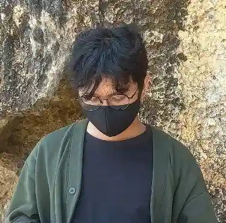

# Hello there 👋,

{ align=left img-size=md img-pos=left } I'm Dali Kewara, a guy who lives and
works as a 👨‍💻 Backend Developer in Indonesia—building useful and unexpected things, and trying to make positive impacts for people.
I love coding and drawing my own worlds. ==*I'm on an unexpected journey and going
to make it simple yet spectacular!*==

The last sentence in the first paragraph is my motto. So yeah, I’m the kind of person who avoids complexity and just sees everything as
something ordinary. What makes me interested is simplicity and clarity. Take Go’s error handling, for example:
 
&nbsp;

```go
if err != nil {
    return err
}
```

A lot of people hate it, but to me, it's the best error handling ever 🔥

## 🙎‍♂️ What Am I Doing In Real Life?

I have been working as a Software Engineer (Backend) for living since 2016, at least for these companies:

- [Vascomm](https://www.vascomm.co.id) (2016-2021)
- [RCTI+](https://www.rctiplus.com) (2022)
- [Warung Pintar](https://warungpintar.co.id) (2023)
- currently at [Renos](https://renos.id).

After working hours, I sometimes enjoy myself by watching [solo bushcraft content](https://www.youtube.com/results?search_query=solo+bushcraft+bertram+nagualero)
on YouTube, 🎮 playing The Legend of Zelda and Monster Hunter on My Nintendo devices (Switch & 3DS), and play Dota—turbo mode—on Steam
(only if I get invited to a party). I like traveling too, even though I don't do it very often.

I can sit in front of a monitor for hours doing coding—depends on the mood btw. With so many cases and issues I've faced,
some of them pushed me to create tools or packages to make things easier. I also hope these tools can be useful for others.
You might find them on this website, as it’s intended to be a place where I document my work.

## How Do I Communicate? 🗣

I love explaining things in detail, but I'm not good at verbal communication tbh 😅. I can communicate better through text ⌨.

> Am I Good in English? currently, not really, but I’m keeping on learning. You might notice that this website is written in English, and some sentences
may seem quite polished. That’s mostly because I use the power of AI to help me handle it.

## 🤝 Connect

You can find me on the social media platforms listed in the footer.

> For professional purpose, don't hesitate to email me at *==dalikewara[at]gmail.com==*
