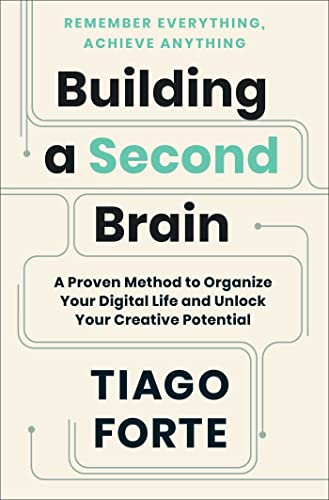

# Membangun Second Brain

Baru-baru ini aku denger sebuah istilah yang cukup menarik dari
[thread Twitter](https://twitter.com/hilmanski/status/1581596970472288256) nya mas [Hilman](https://twitter.com/hilmanski), 
tentang **"[Second Brain](https://www.buildingasecondbrain.com/)"**.
Apa sih itu? Kalau secara sederhana, **Second Brain** itu adalah tempat kita menyimpan dan mengolah berbagai informasi, 
yang itu nggak hanya berguna buat diri kita saat ini, melainkan juga untuk diri kita di masa mendatang.
Kenapa kita perlu **Second Brain**? karna kita perlu sistem yang bisa membantu diri sendiri untuk mengakses, menganalisa,
dan mencari semua informasi dengan gampang, sehingga kita tidak harus pusing mengingat keseluruhan informasi secara detail.
Dan salah satu tujuannya adalah agar ide-ide atau informasi-informasi yang kita susun bisa kita olah untuk membantu kita sehari-hari,
dan bisa terwujud menjadi kenyataan&mdash;baik berupa kreatifitas, karya kerja, ataupun pengembangan diri&mdash;sehingga
nggak hanya berupa ide-ide atau informasi-informasi yang terlupakan saja. Tanpa **Second Brain**, ide-ide
atau informasi-informasi yang kita pikirkan mungkin akan terkesan *random* di otak fisik kita, dan sulit untuk diolah.
Karna itu kita butuh alat bantu.

> **Second Brain** ini ada bukunya, judulnya **"Building a Second Brain"** dari Tiago Forte. Silahkan baca bukunya supaya
lebih jelas dan lengkap tentang konsep ini.

## Apa otak fisik kita belum cukup?

Dari yang aku baca, otak fisik kita itu pada dasarnya lebih banyak dipakai dan lebih ditujukan untuk berfikir,
bukan untuk menyimpan atau mengingat berbagai hal dalam jangka waktu yang lama. Meskipun memang, beberapa orang ada yang
diberi ingatan yang cukup baik&mdash;ingatan jangka panjangnya kuat&mdash;tapi kalau kebanyakan informasi atau *memory* yang diingat,
tentunya akan lebih mudah lupa juga. Nah biasanya ini disebut sebagai *Information Overload*, kondisi dimana saking banyaknya informasi yang diserap,
malah bisa bikin bingung, bisa bikin lupa, dan bisa bikin susah juga mengambil keputusan.

### Daily case?

Ini juga sering aku alami sih kondisi ini, misal pas habis *grooming* gitu ya, sehari dua hari mungkin masih hafal kontennya apa aja.
Tapi karna setelahnya banyak dipakek buat nonton film misal, baca artikel, atau maen *game* kalah gitu ya&mdash;kepikiran&mdash;jadi banyak
yang masuk di pikiran berhari-hari. Nah, nggak jarang pas hari-hari berikutnya mulai agak lupa yang dibahas kemarin apa aja. Jadi seringnya
aku mesti bikin kayak catatan kecil buat nyatet poin-poin penting *grooming*nya apa aja, atau baca ulang PRD nya, atau di *card* jiranya 
waktu ngerjain *task* biasanya aku suka tambahin keterangan *changes*nya, *how to test* nya, sama spesifikasi *task*nya&mdash;biar nggak kelupaan lagi.
Meskipun nggak banyak dan belum terlalu sering, yang penting *memory*nya biar bisa *refresh* gitu pas baca ulang lagi catetannya.

Nah, ini tanpa sadar sebenernya aku tuh sedang membangun **Second Brain** ku sendiri. Meskipun cuman bikin catatan kecil dan belum terlalu terstruktur,
tapi ini membantu ku buat mengingat kembali informasi-informasi penting, dan emang inti pokok dari konsep **Second Brain** itu nyatet
sebenernya&mdash;seni mencatat.

### FOMO

Terus ada juga masalah yang lain, FOMO misalnya, *Fear or Missing Out*, atau takut ketinggalan.
Biasanya aku sering menemukan ini di dunia saham atau crypto. Biasanya muncul kalau kita terlalu sering baca-baca di grup komunitas.
Biasanya kan suka ada yang *share* tuh saham-saham yang diprediksi bakal naik, atau misal di grup crypto,
suka ada yang share koin-koin micin yang diramal bisa naik ribuan persen&mdash; berharap modal 100rb jadi 100 juta&mdash;biasanya kan gitu ya.
Nah, itu kalau kita nggak olah informasi-informasi liar itu, kita bisa saja kena FOMO. Kita jadi ikutan beli, padahal sebenernya kan hal-hal kayak
saham-saham gitu pasti ada analisanya dulu, nggak asal beli. Belum tentu bisa naik sekian persen, dan nggak ada yang
bisa menjamin juga, malah bisa jadi rugi sendiri.

Nah karna itu, selain butuh alat bantu buat mengingat, kita ternyata juga butuh alat bantu untuk mengolah informasi.

## Medium buat Second Brain

Kalau di bukunya sendiri, **Second Brain** tuh lebih diterapkan menggunakan *digital tools*,
misal pakek aplikasi kayak Evernote, Google Keep, Apple Notes, dan sejenisnya. Kenapa *digital tools*?
karna catatan-catatan kita akan lebih mudah buat di *manage*, misal mudah di *searching*, di *grouping*,
di *synchonize* ke *multiple device*, dan mudah juga buat di *share*. Meskipun menurutku pakek
*analog tools* juga bisa sih, misal buku fisik atau kertas kanban, selama itu
kita bikinnya tetap mudah untuk di *manage*. Yang penting idenya
adalah mencatat informasi dan kemudahan akses. Cuman kekurangannya kalau pakai
kertas, kalau catetan kita udah sangat banyak, pasti akan sulit nyari-nyari nya,
kita mesti buka catetannya satu per satu. Karna itu pakek aplikasi lebih disarankan.

## Terus apa bedanya dengan nyatet biasa, atau bedanya dengan buku harian misalnya?

Menurutku bedanya disini ada di metode nya. Kalau buku harian atau catetan biasa kan
kita nyatet kejadian yang kita alami, dan ya udah asal nyatet apa yang kita ingat aja gitu kan ya, tanpa ada *follow up* lebih lanjut.
kalau **Second Brain** tuh dia lebih bersifat sistematis, dan ada *follow up* setelahnya&mdash;setelah kita nyatet. Artinya kita bikin **Second Brain**
bukan untuk diri kita saat ini aja, tapi juga untuk memudahkan kita mengerjakan sesuatu dimasa mendatang.

## Metode membangun Second Brain

Di bukunya sendiri, ada 4 cara yang dipakai untuk membangun **Second Brain**,
yang disingkat **CODE**; ada **Capture**, **Organize**, **Distill** dan **Express**.

> Kalau menurutku sih metode ini optional ya, soalnya kan kemudahan dan strategi
> tiap orang dalam mengatur catatannya bisa berbeda-beda, mungkin ada yang cocok pakek metode CODE, ada yang
> tidak. Selama dia bisa menggunakan catatannya sebagai Second Brainnya dia, well, it's ok menurutku.

### Capture

Di tahap ini, tugas kita adalah mencatat semua informasi yang menurut
kita menarik, atau yang menurut kita penting. Bisa berupa *highlight* artikel,
kutipan, obrolan, catatan meeting, atau apapun yang ada di pikiran. Contoh misal *grooming* fitur baru,
kita bisa catet obrolan-obrolan penting terkait fiturnya
yang sedang dibahas. Misal yang berhubungan dengan spesifikasi fiturnya, atau *flow* dari fiturnya, cara *testing*, dll.
Kita juga bisa meng*capture* konten-konten dari PRD nya untuk dicatat, untuk kita
olah lagi nantinya. Pokoknya dicatet aja dulu.

> Terus, ini juga penting untuk menjadikan kegiatan mencatat menjadi sebuah
> kebiasaan. Karna nggak ada ruginya sih menurutku, malah bisa sangat bermanfaat bagi kita di
> kemudian hari.

### Organize

Di tahap ini, kita mengatur semua informasi yang telah kita *capture*&mdash;yang telah kita catat&mdash; menjadi
sesuatu yang lebih terstruktur. kalau di bukunya, Tiago Forte menggunakan metode **PARA** untuk mengatur
informasi; ada **Projects**, **Areas**, **Resources** dan **Archives**.

- **Projects**
  - Disini kita mencatat hal-hal yang lagi dikerjakan atau yang akan dikerjakan
    dalam waktu dekat
- **Areas**
  - Disini kita mencatat informasi-informasi yang akan kita pakai untuk diri kita
    dalam jangka panjang
- **Resources**
  - Disini kita banyak mencatat dari riset, yang sekiranya akan berguna
    untuk kita dimasa mendatang
- **Archives**
  - Disini tempat kita menaruh *projects* yang sudah dikerjakan, atau
    catatan-catatan yang sekiranya sudah nggak relevan lagi. Kenapa tetep di simpan? karna
    senggaknya kalau suatu saat butuh, bisa dicari lagi mudah

> Balik lagi, ini optional juga menurutku, kita bisa ikut cara ini atau enggak, karna preferensi
> kemudahan tiap orang berbeda-beda.

Contoh fitur baru tadi ya, di tahap *organize* ini kita mungkin akan lebih banyak mencatat
terkait hal-hal yang lebih bersifat teknis, yang berhubungan dengan fiturnya. Misal harus *coding* di *repository*
yang mana, *dependency* fiturnya ke mana aja, riset *flow* eksisting, dll.

### Distill

Di tahap ini, kita melakukan *sorting* serta analisis dari catatan yang kita bikin sebelumnya. Kita cari inti
atau poin-poin pentingnya apa aja, terus bisa juga dibikin *summary*. Jadi sebaiknya jangan hanya asal mencatat aja, 
bisa jadi malah kedepannya bikin kita bingung sendiri. Karna terlalu banyak yang dicatat, jadi susah nyari poin-poin penting atau inti dari catatan
kita itu apa, jadi susah juga nyari tau yang mau atau akan kita kerjakan dari catatan itu apa.

### Express

Di tahap ini, kita melalukan realisasi atau *follow up*, atau pengambilan tindakan, terhadap catatan yang udah kita bikin.
Dari tahap-tahapan diatas, kita pecah menjadi bagian-bagian kecil yang memungkinkan dan bisa mulai dikerjakan dulu, tidak perlu nunggu sampai selesai dulu,
yang penting kita bisa mulai mengerjakan dari hal-hal kecil terlebih dahulu, karna ini akan membantu kita menemukan hal-hal baru yang bisa
dikerjakan nantinya.

Contoh fitur baru tadi, setelah kita punya catatan gambaran umum fiturnya,
terus kita udah *organize* menjadi catatan yang lebih teknikal,
dan kita udah tau poin-poin penting fiturnya apa aja, kita bisa mulai membuat
kayak semacam TODO list dengan subtask-subtask kecil untuk dikerjakan, sampai
akhirnya fiturnya selesai dikerjakan semua. Dengan bikin **Second Brain** kayak gini tuh, membuat apa yang kita kerjakan
jadi lebih terstruktur. Jadi misal ditengah jalan kita ada kendala, kita bisa
liat catetan **Second Brain** kita lagi, sehingga lebih mudah *tracing* kira-kira *blocker*nya dimana, atau *miss*nya dimana, atau kurangnya dimana.
Terutama kalau yang kita kerjain baru ketauan ada *issue* misal berbulan-bulan setelahnya, atau pokoknya lama setelahnya, udah jadi fitur *legacy* misal.
Kalau ga ada **Second Brain**, hanya mengandalkan otak fisik kita, kita kemungkinan besar akan kelupaan, atau kita ingat beberapa hal tapi lupa
dulu *flow* ngerjainnya kayak gimana, alurnya gimana, relasinya kemana aja, jadi susah buat *tracing* dan me*refresh* kembali.

Dokumentasi kalau menurutku bisa disebut sebagai **Second Brain** juga
sih, meskipun mungkin nggak disebutin secara detail sampai ke alur pengerjaan
& catatan-catatan riset gitu ya, tapi bisa membantu me*refresh* *memory* kita
dan menggali informasi-informasi penting.

## The Second Brain is not only a place to take notes

*...but your projects or problems can be slowly resolved with this thinking assistant.*

## Let's read the book!

*There are many interesting relevant topics in the book, like **Personal Knowledge Management**, **Extended Cognition**, etc.*

